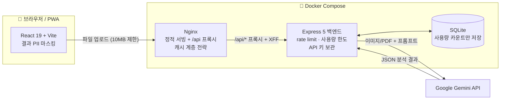

# Clause Guard (절조) 🏠🛡️

> **AI가 계약서의 위험 조항을 대신 읽어주는 서비스** — 전세 사기 뉴스를 보고 시작해, 모든 계약서로 확장한 풀스택 사이드 프로젝트

[](https://react.dev)
[](https://www.typescriptlang.org)
[](https://expressjs.com)
[](https://www.docker.com)
[](https://nginx.org)
[](https://github.com/features/actions)
[](https://ai.google.dev)

**🔗 라이브 데모: [clause-guard.smko.cloud](https://clause-guard.smko.cloud)** — 설치 없이 바로 사용 가능 (모바일 최적화 + PWA)
> ℹ️ 개인 서버에서 운영하는 데모라 일일 이용 한도가 있으며, 사정에 따라 예고 없이 중단될 수 있습니다. 접속이 안 되면 아래 스크린샷을 참고해 주세요.

계약서 사진/PDF를 올리면 AI가 조항 하나하나를 **안전 / 모호 / 위험** 3단계로 분류하고, 위험한 이유와 수정 제안(특약)까지 알기 쉬운 비유로 설명합니다. 전세·매매 계약뿐 아니라 근로계약, 용역 계약, NDA까지 계약 유형을 자동 판별해 유형별 관점으로 분석합니다.

> ⚠️ 이 레포는 **쇼케이스용 문서 레포**입니다. 전체 소스는 프라이빗이며, 실력이 드러나는 핵심 코드 일부를 [`code-samples/`](code-samples/)에 발췌해 두었습니다.

---

## 📸 데모

<!-- 📸 IMAGE-01 -->
> 🖼️ **[여기에 이미지 삽입: 메인 화면 — 파일 업로드]**
> - 권장: 모바일 화면 비율로, 계약서 이미지를 드래그해 업로드하는 장면 스크린샷 1장
> - 주의: 실제 계약서 대신 인터넷의 표준 계약서 양식 등 테스트 문서로 촬영. 파일명에 개인정보가 없는지 확인
> - 파일 위치: `images/01-upload.png` → 삽입 후 이 블록 전체를 `` 으로 교체

<!-- 📸 IMAGE-02 -->
> 🖼️ **[여기에 이미지 삽입: 분석 결과 대시보드]**
> - 권장: 업로드 → 분석 로딩 → 결과(전체 위험도 + 위험/모호 조항 탭 + 특약 제안)까지 이어지는 10초 이내 GIF
> - 주의: 테스트 계약서로 촬영하고, 결과에 실제 이름·주소·금액이 보이면 마스킹된 상태인지 확인
> - 파일 위치: `images/02-analysis.gif` → 삽입 후 이 블록 전체를 `` 으로 교체

<!-- 📸 IMAGE-03 -->
> 🖼️ **[여기에 이미지 삽입: 다크 모드 + PWA 설치]**
> - 권장: 다크 모드 화면 1장 + 홈 화면에 추가된 PWA 아이콘이 보이는 모바일 스크린샷 1장 (나란히 배치)
> - 파일 위치: `images/03-pwa-dark.png` → 삽입 후 이 블록 전체를 `` 으로 교체

---

## 🤔 만든 이유

전세 사기가 사회 문제가 되던 시기, 주변에서 "계약서를 봐도 뭐가 위험한 조항인지 모르겠다"는 이야기를 반복해서 들었습니다. 법률 상담은 문턱이 높고, 검색으로는 내 계약서의 특정 문장이 위험한지 알 수 없습니다. "계약서를 찍어서 올리면 AI가 조항별로 짚어주는 서비스"를 직접 만들어 보기로 했고, 만들다 보니 전세뿐 아니라 근로·용역·NDA 등 모든 계약에 같은 문제가 있어 범용 계약 분석으로 확장했습니다.

동시에 이 프로젝트는 **"개인 프로젝트를 실제로 운영하면 부딪히는 문제들"** — API 비용 폭탄, 어뷰징, 프록시 뒤 IP 식별, PWA 캐시 꼬임 — 을 정면으로 겪고 해결해 본 운영 실험이기도 합니다.

---

## ✨ 핵심 기능 — 그리고 왜 어려웠는지

| 기능 | 어려웠던 지점 |
| :--- | :--- |
| **계약 유형 자동 판별 + 조항별 3단계 위험도 분석** | LLM이 "그럴듯한 자유 서술"로 빠지지 않도록, 유형 판별 → 조항 추출 → 위험도 분류 → 스키마 강제라는 단계적 프롬프트 구조와 JSON 응답 강제를 설계. 프롬프트 원문은 서비스 품질의 핵심이라 비공개 |
| **LLM 응답의 방어적 파싱** | 모델은 JSON을 약속해도 코드펜스로 감싸거나 뒤에 설명을 붙임. 괄호 짝을 추적하는 [`extractJson`](code-samples/extractJson.ts)으로 어떤 응답에서도 JSON만 안전 추출 + 테스트로 고정 |
| **API 비용 방어 (3중 한도)** | 무료 공개 서비스는 어뷰징 한 번에 API 예산이 증발. **전역 일일 한도 / 사용자별 일일 한도 / 분당 요청 제한**의 3중 방어를 SQLite 원자적 UPSERT 위에 구축 |
| **VPN 우회 대응 이중 식별** | IP만으로 제한하면 VPN으로 우회됨 → **IP + Device ID(localStorage UUID)** 를 병행 추적해 어느 한쪽만 초과해도 차단 |
| **개인정보 보호 설계** | 계약서 원본은 서버에 저장하지 않고 분석 후 폐기. 분석 결과 텍스트는 클라이언트에서 [정규식 + 문맥 기반 마스킹](code-samples/masking.ts)(주민번호·전화·이메일·이름) 처리 |
| **API 키 완전 은닉** | 프론트에서 Gemini를 직접 호출하면 키가 번들에 노출됨 → Express 프록시 서버를 두어 키가 서버 밖으로 나가지 않는 구조로 전환 |

---

## 🏗️ 아키텍처



**데이터 흐름 요약**: 사용자가 계약서 파일을 올리면 Nginx가 `/api/analyze`로 프록시 → 백엔드가 한도 체크 후 Gemini에 파일과 분석 프롬프트를 전달 → 응답에서 JSON만 방어적으로 추출해 반환 → 프론트가 결과 텍스트를 마스킹해 렌더링. **계약서 원본은 어디에도 저장되지 않습니다.**

배포는 `main` push → GitHub Actions가 프론트/백엔드 Docker 이미지를 GHCR에 빌드·푸시 → 서버에서 Docker Compose로 구동 → Cloudflare Tunnel로 공개하는 파이프라인입니다.

📄 **상세 설계 문서**: [docs/architecture.md](docs/architecture.md) — 요청 시퀀스, 비용 방어 계층, 캐시 전략, CI/CD 파이프라인

---

## 🧰 기술 스택과 선택 이유

| 기술 | 선택 이유 |
| :--- | :--- |
| **React 19 + TypeScript + Vite** | 분석 결과처럼 상태가 많은 UI를 타입 안정성 있게. Vite는 PWA 플러그인 생태계와 빌드 속도 |
| **Express 5** | "API 키를 숨기는 프록시 + 한도 관리"가 목적이라 가볍고 미들웨어 조합이 자유로운 프레임워크가 적합 |
| **Google Gemini (멀티모달)** | 계약서가 대부분 **사진/PDF**로 들어옴 — OCR 파이프라인 없이 이미지를 직접 이해하는 멀티모달 모델로 단계를 하나 제거 |
| **SQLite** | 저장 대상이 사용량 카운트뿐 — 별도 DB 서버 없이 파일 하나로 충분하고, `ON CONFLICT` UPSERT로 동시성 문제도 해결 가능 |
| **Nginx** | 정적 서빙 + API 프록시 + 업로드 크기 제한 + 캐시 헤더 제어를 한 곳에서. PWA 캐시 사고 이후 캐시 전략의 중심이 됨 |
| **Docker Compose + GHCR** | 프론트/백엔드를 독립 이미지로 분리해 healthcheck 기반 기동 순서 보장, push만 하면 배포 이미지가 준비되는 파이프라인 |
| **Cloudflare Tunnel** | 포트포워딩·고정 IP 없이 홈서버를 안전하게 공개. 원 서버 주소 비노출 |
| **Vitest** | LLM 응답 파서와 마스킹처럼 "엣지 케이스가 곧 버그"인 순수 함수를 회귀 테스트로 고정 |

---

## 🔥 기술적 도전과 해결

### 1. Rate limit이 전 사용자를 하나로 묶어버린 버그

- **문제 상황**: `express-rate-limit`로 분당 요청 제한을 걸었는데, 운영 환경에서 **서로 다른 사용자들이 동시에 429**를 맞는 현상 발생. 한 명이 한도를 쓰면 모두가 차단됐다.
- **시도한 것들**: 처음엔 `app.set('trust proxy', 1)`로 접근했지만, Nginx + Cloudflare **이중 프록시** 환경에서 hop 수 설정이 어긋나면 오히려 임의 헤더로 IP를 위조할 수 있는 보안 구멍이 생김을 확인.
- **최종 해결**: 원인은 프록시 뒤에서 `req.ip`가 항상 **프록시 컨테이너의 IP 하나**로 잡혀 전원이 rate limit 버킷 하나를 공유한 것. `trust proxy` 대신 rate limiter의 `keyGenerator`를 `X-Forwarded-For`를 파싱하는 `request-ip` 기반(`req.clientIp`)으로 교체해, 신뢰 범위를 rate limit 키 계산에만 한정했다. → [`code-samples/rate-limit-usage-guard.ts`](code-samples/rate-limit-usage-guard.ts)
- **결과**: 사용자별 제한이 정상 동작. "프록시 뒤 IP 식별"은 이후 사용량 한도·로깅 전반의 기반이 됐다.

### 2. PWA 서비스워커가 API 요청을 가로채던 문제

- **문제 상황**: PWA 도입 후 일부 사용자에게서 분석 요청이 서버에 도달하지 않고 **서비스워커가 캐시된 HTML을 반환**하는 현상 발생. 프론트는 정상처럼 보이는데 분석만 실패하는, 재현이 어려운 버그였다.
- **시도한 것들**: 프론트 fetch 로직·CORS·Nginx 프록시를 순서대로 의심하며 배제해 나감. 결국 서비스워커의 navigation fallback이 `/api` 경로까지 SPA 라우팅으로 처리하고 있음을 발견.
- **최종 해결**: 서비스워커 설정에서 `/api` 경로를 캐시·fallback 대상에서 명시적으로 제외해, API 요청은 항상 네트워크로 통과시키도록 수정.
- **결과**: 간헐적 분석 실패 재발 없음. "PWA에서 API 경로는 반드시 서비스워커 스코프에서 제외 설계"라는 체크리스트를 얻었다.

### 3. 배포해도 사용자에게는 옛 버전이 보이는 캐시 고착

- **문제 상황**: 새 버전을 배포해도 일부 기기에서 **옛 버전이 계속 뜨는** 현상. PWA 셸(`index.html`, `sw.js`)이 브라우저·Cloudflare에 캐시되어 갱신 신호 자체가 전달되지 않았다.
- **최종 해결**: Nginx에서 캐시를 **두 계층으로 분리** — 갱신의 진입점인 `index.html`·서비스워커·매니페스트는 `no-cache, must-revalidate`로 매번 원본 확인, 반대로 해시가 파일명에 박히는 `/assets/*`는 `max-age=1y, immutable`로 최대한 캐시. → [`code-samples/nginx.conf`](code-samples/nginx.conf)
- **결과**: 배포 즉시 전 기기에서 새 버전 반영, 정적 자산은 장기 캐시로 재방문 로딩 최소화. "무엇을 캐시하면 안 되는가"가 캐시 전략의 절반임을 배웠다.

### 4. "JSON으로 답해"라고 해도 JSON만 오지 않는 LLM

- **문제 상황**: 프롬프트로 JSON 스키마를 강제해도 모델이 종종 ` ```json ` 코드펜스로 감싸거나, JSON 뒤에 "위 내용은 분석 결과입니다" 같은 꼬리 설명을 붙여 `JSON.parse`가 간헐적으로 실패.
- **시도한 것들**: 정규식으로 코드펜스만 제거 → 후행 텍스트 케이스에서 여전히 실패. `responseMimeType: application/json` 옵션 병행 → 완화되지만 보장은 아님.
- **최종 해결**: 첫 `{`부터 **괄호 깊이를 추적해 짝이 맞는 `}`까지만** 잘라 파싱하는 `extractJson`을 별도 모듈로 분리하고, 실패 유형(코드펜스·후행 텍스트·중첩 객체·미닫힘)을 Vitest 케이스로 고정. → [`code-samples/extractJson.ts`](code-samples/extractJson.ts) / [테스트](code-samples/extractJson.test.ts)
- **결과**: 응답 형식 변동에 의한 파싱 실패 재발 없음. "LLM 출력은 외부 입력처럼 방어적으로 다룬다"는 원칙을 코드로 남겼다.

---

## 📊 성과 / 수치

- **실서비스 운영 중**: 2026년 1월 MVP 런칭 후 도메인 연결·PWA·Docker 배포까지 완료하고 현재까지 운영 — [clause-guard.smko.cloud](https://clause-guard.smko.cloud)
- **비용 통제**: 소액의 월 API 예산 안에서 무료 공개 서비스를 유지하도록 3중 사용량 한도 설계 (예산 초과 사고 0회)
- **배포 자동화**: `git push` 한 번으로 프론트/백엔드 이미지 2개가 GHCR에 빌드·푸시되는 무중단에 준하는 배포 파이프라인 (healthcheck 기반 기동 순서 보장)
- **개인정보 무저장**: 계약서 원본을 저장하는 저장소·로그가 설계상 존재하지 않음 (사용량 카운트만 SQLite에 기록)
- **입력 방어**: 파일 크기 제한을 프론트·Nginx·백엔드(multer) **3중**으로 적용
- **회귀 테스트**: 장애 원인이 됐던 두 모듈(LLM 응답 파서, PII 마스킹)을 Vitest로 커버

---

## 📁 프로젝트 구조 (원본 레포 기준)

```
docker-clause-guard/
├── src/                        # React 프론트엔드
│   ├── App.tsx                 # 상태 관리 · 테마 · Device ID 발급 · 분석 흐름
│   ├── components/
│   │   ├── FileUploader.tsx    # 드래그&드롭 업로더 (크기 제한 1차 검증)
│   │   └── AnalysisResult.tsx  # 위험/모호 탭 + 안전 조항 토글 대시보드
│   ├── services/gemini.ts      # 백엔드 /api/analyze 호출 (키 없음)
│   └── utils/masking.ts        # 정규식 + 문맥 기반 PII 마스킹 (+ 테스트)
├── server/                     # Express 백엔드
│   ├── index.ts                # 엔드포인트 · rate limit · 사용량 한도 · Gemini 호출
│   │                           #   └ [비공개] 계약 분석 프롬프트 본문
│   ├── extractJson.ts          # LLM 응답 방어적 JSON 추출기 (+ 테스트)
│   └── db.ts                   # SQLite 초기화 + 원자적 UPSERT 사용량 카운트
├── nginx.conf                  # 정적 서빙 + API 프록시 + 캐시 계층 전략
├── Dockerfile.frontend         # 멀티스테이지 빌드 (Vite build → Nginx)
├── Dockerfile.backend          # tsx 런타임 실행 (네이티브 모듈 빌드 포함)
├── docker-compose.yml          # 2컨테이너 구성 + healthcheck 기동 순서
└── .github/workflows/          # main push → GHCR 이미지 빌드/푸시
```

---

## 🌱 배운 점

- **운영이 설계를 가르친다.** rate limit 버킷 공유, PWA 캐시 고착, 서비스워커의 API 가로채기 — 전부 로컬에선 재현되지 않고 실사용자 환경에서만 드러났다. "배포하고 지켜보는 것"까지가 개발이라는 걸 체감했다.
- **LLM은 외부 입력이다.** 모델의 출력은 약속이 아니라 확률이므로, 파서·스키마 검증·테스트로 감싸야 프로덕트가 된다.
- **비용 방어는 기능이다.** 무료 공개 서비스에서 사용량 한도 설계는 부가 기능이 아니라 서비스의 생존 조건이었다.
- **보안은 기본값 싸움이다.** API 키 서버 은닉, CORS 화이트리스트, 에러 메시지 비노출, `.dockerignore` — 하나하나는 작지만, 기본값을 안전하게 두는 습관이 사고를 막았다.

---

## 📸 이미지 플레이스홀더 목록

| 번호 | 위치 | 촬영할 장면 | 파일 |
| :--- | :--- | :--- | :--- |
| IMAGE-01 | README › 데모 | 메인 화면에서 계약서 파일 업로드 | `images/01-upload.png` |
| IMAGE-02 | README › 데모 | 업로드→분석→결과 대시보드 흐름 GIF (10초 이내) | `images/02-analysis.gif` |
| IMAGE-03 | README › 데모 | 다크 모드 + 모바일 PWA 설치 화면 | `images/03-pwa-dark.png` |
| IMAGE-04 | docs/architecture.md › 배포 | GitHub Actions 빌드 성공 화면 | `images/04-ci.png` |

> 💡 촬영 공통 주의: 실제 계약서 대신 표준 양식 등 테스트 문서 사용, 결과 화면에 실명·주소·금액이 보이면 마스킹 상태 확인, 브라우저 주소창·탭에 개인 정보가 없는지 확인.
