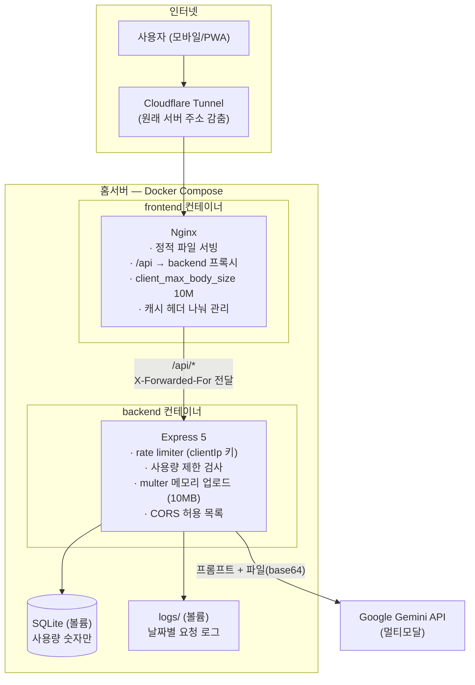
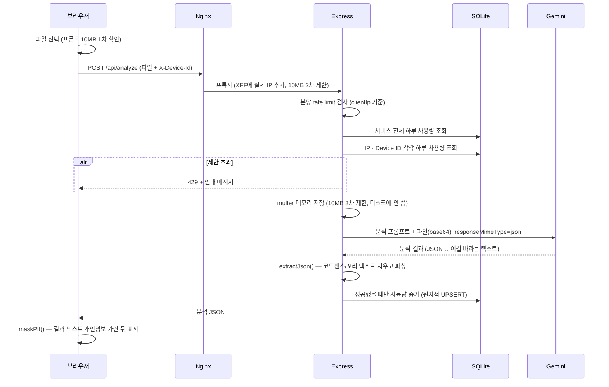
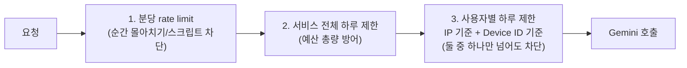
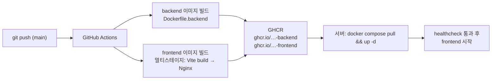

# Clause Guard — 자세한 아키텍처

> 이 문서는 [README](../README.md)의 아키텍처 섹션을 더 깊이 다룹니다.
> 코드 전체는 비공개이며, 여기서는 설계 의도와 구조를 설명합니다. 핵심 코드 일부는 [`code-samples/`](../code-samples/) 참고.

## 목차

1. [전체 구성](#1-전체-구성)
2. [분석 요청이 처리되는 과정](#2-분석-요청이-처리되는-과정)
3. [비용 방어 단계](#3-비용-방어-단계)
4. [개인정보 설계](#4-개인정보-설계)
5. [프론트엔드 캐시 전략](#5-프론트엔드-캐시-전략)
6. [CI/CD 파이프라인](#6-cicd-파이프라인)
7. [일부러 감수한 트레이드오프](#7-일부러-감수한-트레이드오프)

---

## 1. 전체 구성



핵심 결정 세 가지:

- **프론트는 Gemini를 모른다.** API 키는 백엔드 환경변수에만 있고, 프론트는 `/api/analyze`만 부른다. 키가 번들·네트워크 탭 어디에도 나타나지 않는다.
- **컨테이너 2개로 나눔.** 프론트(Nginx)와 백엔드(Express)를 따로 이미지로 빌드해 각자 배포·재시작할 수 있다. compose의 `depends_on: condition: service_healthy`로 백엔드 헬스체크(`/api/health`)를 통과한 뒤에만 프론트가 뜬다.
- **상태는 볼륨으로.** SQLite 파일과 로그는 호스트 볼륨에 연결되어 컨테이너를 다시 배포해도 그대로 남는다. 이미지에는 `.dockerignore`로 `.env`·`data`·`logs`가 절대 들어가지 않는다.

---

## 2. 분석 요청이 처리되는 과정



설계 포인트:

- **사용량은 성공한 뒤에만 올린다.** 파싱 실패·API 오류로 결과를 못 받은 사용자의 횟수를 깎지 않기 위한 의도적 순서다. 확인과 증가 사이에 아주 짧은 빈틈(TOCTOU)이 있지만, 개인 서비스 규모에서 "실패해도 횟수 차감"보다 사용자 경험 손해가 작다고 봤다 ([7절](#7-일부러-감수한-트레이드오프)).
- **증가 자체는 원자적.** `INSERT ... ON CONFLICT ... DO UPDATE SET count = count + 1` UPSERT라 동시 요청이 겹쳐도 숫자가 날아가지 않는다. (읽고-고치고-쓰는 방식을 앱에서 하다가 동시 요청 문제를 발견하고 바꾼 부분)
- **에러는 두 갈래로.** 클라이언트에는 뭉뚱그린 메시지만 돌려주고, 스택·원문은 서버 로그에만 남긴다. 내부 구현이 에러 메시지로 새는 것을 막는다.

### AI 응답 형식

프롬프트가 강제하는 응답 구조 (프롬프트 본문은 비공개, 구조만 공개):

```ts
{
  contractType: string;                       // 자동으로 알아낸 계약 종류
  summary: string;                            // 전체 요약
  overallRisk: "Low" | "Medium" | "High";
  clauses: Array<{
    originalText: string;                     // 계약서상 원문 조항
    status: "Safe" | "Ambiguous" | "Dangerous";
    explanation: string;                      // 비유를 담은 쉬운 설명
    recommendation: string;                   // 고칠 방법 / 추가할 특약
  }>;
}
```

프롬프트는 **1. 계약 종류 알아내기 → 2. 종류별 관점으로 조항 뽑기 → 3. 3단계 위험도 나누기 → 4. 위 JSON 형식 강제**의 단계별 구조로 설계되어 있고, 계약 종류별(부동산/근로/용역)로 집중해서 볼 법적 관점을 다르게 지정한다.

---

## 3. 비용 방어 단계

무료 공개 + 쓴 만큼 내는 LLM API 조합은 방어 없이는 성립하지 않는다. 요청 하나가 지나야 하는 문을 겹겹이 쌓았다:



| 단계 | 막는 것 | 구현 |
| :--- | :--- | :--- |
| 분당 rate limit | 스크립트로 몰아치는 요청, 단순 DoS | `express-rate-limit` + `keyGenerator: req.clientIp` |
| 서비스 전체 하루 제한 | 예산 자체가 바닥나는 것 — 어떤 상황에서도 하루 지출 상한 보장 | SQLite `global_usage_logs` |
| 사용자별 하루 제한 | 한 사용자가 독차지하는 것 | SQLite `daily_usage_logs`, IP와 Device ID **각각** 기록 |

- **왜 두 가지로 확인하나**: IP만 쓰면 VPN·테더링 재접속으로 피해 갈 수 있고, Device ID(localStorage UUID)만 쓰면 시크릿 창으로 피해 갈 수 있다. 둘을 모두 추적하고 **하나만 넘어도 막으면** 피해 가는 비용이 크게 올라간다.
- **왜 `trust proxy`가 아니라 `keyGenerator`인가**: Nginx + Cloudflare 이중 프록시에서 `trust proxy` 단계 수 설정이 어긋나면 클라이언트가 헤더로 IP를 속일 수 있다. 믿는 범위를 "rate limit 키 계산"에만 좁히는 쪽이 실수할 여지가 작았다. → [`code-samples/rate-limit-usage-guard.ts`](../code-samples/rate-limit-usage-guard.ts)
- 제한 횟수의 구체 숫자는 운영 정책상 비공개.

---

## 4. 개인정보 설계

계약서는 이름·주민번호·주소·금액이 모두 담긴 민감한 문서다. 원칙은 **"저장하지 않으면 새어 나갈 것도 없다"**:

| 단계 | 처리 |
| :--- | :--- |
| 업로드 | multer **메모리 스토리지** — 파일이 디스크에 쓰이지 않음 |
| 분석 | 파일은 base64로 Gemini에 전달하고 응답을 받으면 바로 버림 |
| 저장 | 계약서 원본·분석 결과 모두 **DB에 저장하지 않음** (사용량 숫자만 저장) |
| 표시 | 분석 결과 텍스트를 클라이언트에서 `maskPII()`로 가림 — 주민번호·전화번호·이메일은 패턴으로, 이름은 "임차인/성명" 등 **문맥 키워드 뒤 한글 이름**을 잡아 성만 남김 → [`code-samples/masking.ts`](../code-samples/masking.ts) |
| 로그 | 요청 부가 정보(IP, GeoIP 국가, 기기/브라우저)만 기록, 문서 내용은 로그에 남기지 않음 |

솔직하게 적어 둔 한계: **원본 파일 자체는 가리지 않은 채 Gemini로 전송된다** (이미지/PDF는 클라이언트에서 텍스트를 가릴 수 없음). 그래서 서비스 문구도 "원본 저장 안 함 + 결과 가림"으로 정확히 쓴다 — 할 수 있는 것 이상을 약속하지 않는 것도 설계의 일부라고 생각한다.

---

## 5. 프론트엔드 캐시 전략

PWA + Cloudflare + 브라우저 캐시가 겹치면 "배포했는데 사용자는 옛 버전" 문제가 생긴다. 해법은 **새 버전을 알리는 입구와 바뀌지 않는 파일을 나누는 것**:

```
[매번 다시 확인 — no-cache, must-revalidate]
  /index.html          ← 새 버전을 알게 되는 유일한 입구
  /sw.js               ← 서비스워커 갱신 신호
  /registerSW.js
  /manifest.webmanifest

[1년 캐시 — public, max-age=31536000, immutable]
  /assets/*            ← 파일 이름에 내용 해시 포함 → 내용이 바뀌면 URL이 바뀜
```

- 입구가 항상 다시 확인되므로 배포하면 바로 새 해시의 파일 URL이 퍼지고, 파일 자체는 오래 캐시되어 다시 방문할 때 빠르다.
- 서비스워커는 `/api` 경로를 캐시·navigation fallback에서 뺌 — API 요청이 캐시된 HTML로 응답되는 사고를 막는다 (실제로 겪은 버그).
- 전체 설정: [`code-samples/nginx.conf`](../code-samples/nginx.conf)

---

## 6. CI/CD 파이프라인



- 프론트 이미지는 **멀티스테이지 빌드**: 빌드 단계(node)에서 `vite build`를 하고, 결과물만 `nginx:alpine`으로 복사 — 최종 이미지에 소스·node_modules·빌드 도구가 남지 않는다. → [`code-samples/Dockerfile.frontend`](../code-samples/Dockerfile.frontend)
- 인증은 워크플로의 기본 `GITHUB_TOKEN`만 사용 — 따로 만들고 관리할 시크릿이 없다.
- 백엔드는 sqlite3 네이티브 모듈을 빌드하기 위해 python3/make/g++를 이미지 빌드 시점에 설치.

<!-- IMAGE-04 -->
> **[여기에 이미지 삽입: GitHub Actions 빌드 화면]**
> - 권장: 프론트/백엔드 두 job이 나란히 성공(초록 체크)한 워크플로 실행 화면 스크린샷
> - 주의: 레포 이름 외 개인 정보가 화면에 없는지 확인
> - 파일 위치: `images/04-ci.png` → 삽입 후 이 블록 전체를 `` 으로 교체

---

## 7. 일부러 감수한 트레이드오프

완벽함보다 규모에 맞는 선택을 했고, 한계를 알고 있다는 것을 적어 둔다:

| 선택 | 감수한 것 | 판단 이유 |
| :--- | :--- | :--- |
| 사용량 검사: 확인 후 증가(check-then-act) | 확인~증가 사이 아주 짧은 빈틈 (제한 근처에서 1~2회 넘길 수 있음) | 증가 자체는 원자적 UPSERT라 숫자가 날아가지는 않음. "성공했을 때만 차감"이 주는 사용자 경험 이득이 더 큼 |
| SQLite 단일 파일 | 서버를 여러 대로 늘릴 수 없음 | 저장할 것이 숫자뿐인 개인 서비스 — 운영을 단순하게 유지하는 것이 우선 |
| 백엔드 tsx 런타임 실행 (컴파일 없이) | 프로덕션에서 빌드 결과물이 아닌 소스를 실행 | 배포 단순화. 타입 검사는 테스트·개발 시점에 수행 |
| 원본 파일을 가리지 않고 AI에 전송 | 이미지 속 개인정보가 모델에 노출 | 클라이언트에서 이미지 속 글자를 가리는 건 비현실적 — 대신 저장하지 않는 원칙 + 사용자에게 정확히 안내 |
